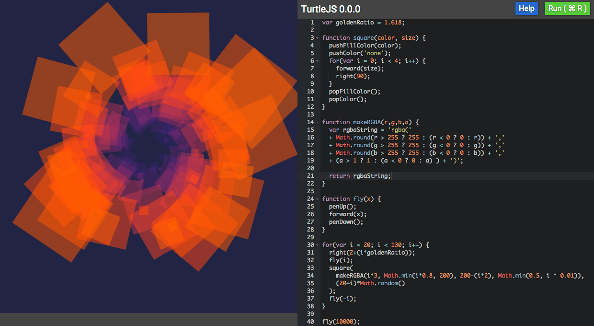

## TurtleJS

A simple JavaScript clone of the LOGO drawing language. Write turtle programs in JavaScript,
saved in your browser.

 * NOTE:  this software is a fun toy written in two days. It only supports firefox and chrome right now. It is not supposed to be clean or perfect, mostly I wrote it for fun.

### [Live Demo](http://sequentialread.github.io/TurtleJS/)

* Ace code editor.
* Useful cheat sheet page.
* Cmd-; to search for selected text on MDN using google JSON search API.
* Error handling and console.log go to integrated console.



### Simple API for drawing:
```
pushColor('red');
forward(50);
right(90);
forward(50);
left(90)
forward(50);
popColor();
```


### Example from screenshot:

```
var goldenRatio = 1.618;

function square(color, size) {
  pushFillColor(color);
  pushColor('none');
  for(var i = 0; i < 4; i++) {
    forward(size);
    right(90);
  }
  popFillColor();
  popColor();
}

function makeRGBA(r,g,b,a) {
  var rgbaString = 'rgba('
  + Math.round(r > 255 ? 255 : (r < 0 ? 0 : r)) + ','
  + Math.round(g > 255 ? 255 : (g < 0 ? 0 : g)) + ','
  + Math.round(b > 255 ? 255 : (b < 0 ? 0 : b)) + ','
  + (a > 1 ? 1 : (a < 0 ? 0 : a) ) + ')';

  return rgbaString;
}

function fly(x) {
  penUp();
  forward(x);
  penDown();
}

for(var i = 20; i < 130; i++) {
  right(2+(i*goldenRatio));
  fly(i);
  square(
    makeRGBA(i*3, Math.min(i*0.8, 200), 200-(i*2), Math.min(0.5, i * 0.01)),
    (20+i)*Math.random()
  );
  fly(-i);
}

fly(10000);
```
